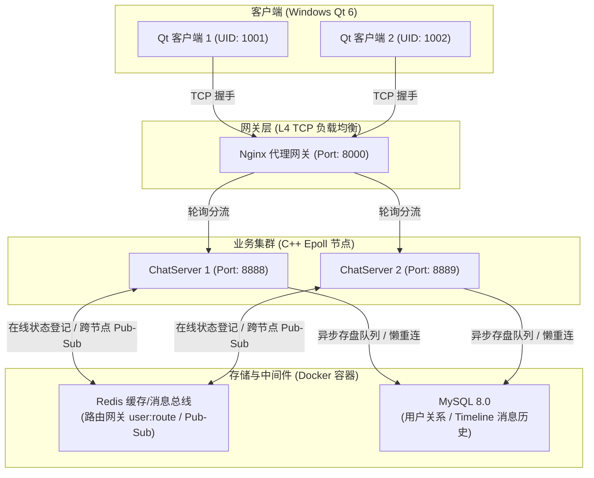

# Simple_IMChat (高性能分布式即时通讯系统)

`Simple_IMChat` 是一款基于 **C++ Epoll 网络架构**与 **Qt 6 C++ 跨平台客户端**构建的分布式即时通讯（IM）系统。项目整体采用 **Docker Compose 进行容器化微服务编排**，并针对高并发、高可用及消息可靠投递场景进行了全方位的深度优化，支持公网异地集群多节点横向扩展。

---

## 🏗️ 分布式系统架构图

项目整体拓扑与数据流向设计如下：



---

## 🌟 核心技术特性

1.  **应用层双向 ACK 与可靠消息投递**：
    *   **指数退避重传**：客户端引入待确认队列（`pendingSendAckMap_`）与心跳检测重传定时器。
    *   **滑动窗口去重**：服务端实现接收确认队列与滑动去重窗口，结合消息序列号机制规避 TCP 连接瞬断、假死引发的丢包与乱序，确保应用层 **At-Least-Once（至少一次）** 投递。
2.  **增量 Timeline (时间线) 离线同步**：
    *   **按需增量拉取**：摒弃传统离线消息拉取方案，采用 Timeline 架构，以单调递增的 `msg_id` 为同步 Key。
    *   **读写冷热分离**：使用 **Redis ZSet 缓存最新 100 条热消息**（保障上线即时拉取），配合 **C++ 异步存盘线程池**将历史消息落盘至 MySQL 历史表，实现高并发下的秒级同步。
3.  **基于 Redis 的在线状态网关与分布式路由**：
    *   **状态与路由发现**：`ChatServer` 节点启动时自动向 Redis 哈希表 `user:route` 注册自身实例 IP 与端口，提供在线状态感知。
    *   **跨服路由转发**：节点间利用 **Redis 发布/订阅（Pub/Sub）** 机制动态中转跨服单聊消息，抹平集群节点差异，支持水平横向扩展。
4.  **连接池故障拦截与 Lazy Reconnect 自愈**：
    *   **前置拦截感知**：在自研 C++ 连接池中设计“惰性重连”机制，执行任何 `update/query` 前置拦截并调用 `mysql_ping()`。
    *   **级联退避重连**：妥善处理 Docker 一键冷启动时依赖项未就绪或因网络瞬断导致的数据库失联，实现**毫秒级自愈重连**，保证系统的高可用性。
5.  **多阶段构建与容器化微服务编排**：
    *   **镜像体积优化**：编写基于 **Multi-stage Build（多阶段构建）** 的 `Dockerfile`，剔除编译依赖，使生产运行镜像体积精简 80%+。
    *   **一键服务编排**：提供配套的 `docker-compose.yml` 脚本，一键拉起 MySQL、Redis、Nginx 负载均衡网关以及双服务节点集群。

---

## 🛠️ 技术栈与环境要求

项目采用 C/C++ 核心网络服务与跨平台 Qt 客户端混合架构，具体构建及运行环境要求如下：

### 服务端 (ChatServer)
- **操作系统**：Linux (WSL2 / Ubuntu 20.04+ / CentOS 7+)，使用 POSIX 网络 API（Epoll 等）。
- **编译器**：支持 C++17 及以上的 GCC/G++ 或 Clang。
- **构建工具**：CMake 3.16+。
- **基础依赖**：Protobuf 3.x+。
- **三方服务**：Redis 6.x+，MySQL 8.0+。

### 客户端 (IMchat)
- **操作系统**：Windows 10 / 11 64-bit。
- **构建套件**：Qt 6.10.1 (MSVC 2022 64-bit)。
- **包管理工具**：vcpkg (管理 Windows 本地 Protobuf 静态/动态库)。

### 部署与网络编排
- **中间件容器**：Docker Desktop，Docker Compose。
- **网络网关**：Nginx L4 负载均衡（TCP 反向代理，暴露 8000 端口）。

---

## 💬 业务功能支持

系统目前已支持以下核心即时通讯业务逻辑：
- [x] **登录/注册**：基于账号 UID 的登录验证与密码哈希校验。
- [x] **好友系统**：好友申请发起、实时推送通知（跨节点路由转发）、好友关系维护。
- [x] **在线状态感知**：好友上线/下线时的状态实时同步。
- [x] **单人聊天**：支持在线用户即时消息传递、离线用户的 Timeline 离线消息缓冲。
- [x] **离线增量拉取**：客户端上线时按需单调递增拉取离线期间丢失的 Timeline 消息。

---

## 🛠️ 项目目录结构

```text
Simple_IMChat/
├── ChatServer/               # C++ 服务端源码目录
│   ├── include/              # 头文件 (网络、数据库连接池、Redis)
│   ├── src/                  # 业务实现源码 (chatservice, model, db)
│   ├── CMakeLists.txt        # 服务端编译脚本
│   └── Dockerfile            # C++ 编译与运行时多阶段构建文件
├── IMchat/                   # Qt 6 客户端源码目录
│   ├── net/                  # TCP 套接字包装与可靠投递逻辑 (imclient)
│   ├── ui/                   # 登录、注册、主界面聊天窗口界面组件
│   └── CMakeLists.txt        # CMake 客户端构建脚本
├── 数据库/
│   └── 数据库设计.md          # 详细的物理表及索引初衷权衡说明
├── 项目优化内容/               # 针对各大面试高含金量亮点的原理性技术文档
├── docker-compose.yml        # 云端一键容器部署编排脚本
└── init.sql                  # 数据库初始化建表与预灌入测试数据脚本
```

---

## 🚀 编译与部署指南

### 1. 云服务端一键部署 (Docker Compose)

在装有 Docker 及 Docker Compose 的云服务器（推荐 CentOS/Alibaba Linux 3 或 Ubuntu）上：

```bash
# 克隆代码仓库
git clone https://github.com/toh520/Simple_IMChat.git
cd Simple_IMChat

# 如果是 CentOS / Alibaba Linux 系列，请关闭与 Docker 网桥冲突的系统防火墙以开放路由
systemctl stop firewalld
systemctl disable firewalld
systemctl restart docker

# 一键编译并拉起所有微服务容器 (自动在 8000 端口监听网关代理)
docker-compose up -d --build
```

### 2. 本地 Windows 客户端编译 (Qt 6 + CMake)

1.  **环境准备**：
    *   确保本地已配置好 **CMake**、**vcpkg** (用于管理第三方依赖如 Protobuf) 以及 **Qt 6.10.1 (MSVC 2022 64-bit)** 构建套件。
2.  使用 **Qt Creator** 或 **Visual Studio 2022** 打开项目下的 `IMchat/CMakeLists.txt`。
3.  定位至 `net/imclient.h`，将默认服务器连接参数更新为您的云服务器公网 IP：
    ```cpp
    static constexpr const char *kServerHost = "您的云服务器IP";
    quint16 serverPort_{8000}; // Nginx 负载均衡端口
    ```
4.  执行 CMake 配置并点击 **“运行” (Ctrl + R)** 按钮完成 Windows 端编译与登录测试。

---

## 📈 性能压测与定量评估 (Benchmark)

项目随附了一套自主研发的 Python 压测工具包（位于 [benchmark.py](file:///d:/code/backend/code/App/ChatServer/benchmark.py)），支持对系统吞吐量、响应延迟、缓存命中率以及并发连接容量（C10K）进行全方位的定量评估。

### 压测前置准备
1. 确保 WSL2 中已开启 `mysql-chat` 和 `redis` 容器。
2. 安装 Python 依赖并生成 proto 模块：
   ```bash
   cd ChatServer
   # 编译 Python 版 Protobuf
   protoc --python_out=./proto msg.proto
   ```

### 1. 消息写入吞吐量与时延压测 (Write Mode)
测试在高并发多用户同时发信时的吞吐上限，可用于对比 **“同步单条直接写库（对照组）”** 与 **“异步内存队列批量存盘（实验组）”** 的性能差异。
```bash
# 异步队列存盘模式（并发数 100，总消息数 10000）
python benchmark.py --mode write --host 127.0.0.1 --port 8000 --concurrency 100 --count 10000

# 同步直接写库模式（开启 --sync 对照组）
python benchmark.py --mode write --host 127.0.0.1 --port 8000 --concurrency 100 --count 10000 --sync
```
*评估指标*：QPS (每秒发送成功消息数)、发信成功率、客户端感知 RTT 延迟 (P50, P95, P99)。

### 2. Timeline 缓存命中与穿透时延评估 (Read Mode)
测试客户端上线同步离线消息时，从 Redis 缓存读取与直接查询 MySQL 数据库的时延对比。
```bash
python benchmark.py --mode read --host 127.0.0.1 --port 8000
```
*定量结论*：当离线消息数量小于 100 条时触发 Redis ZSet 极速响应（通常为毫秒级），超出 100 条时按需穿透查询 MySQL，在保障读写性能的同时实现冷热数据分离，防止 MySQL 遭受因用户登录拉取历史消息而导致的瞬时读风暴。

### 3. C10K 高并发连接与心跳测试 (Conn Mode)
利用 asyncio 异步协程模拟海量客户端并发建立活跃 TCP 连接并维持心跳，测试服务端挂载能力与内存开销。
```bash
python benchmark.py --mode conn --host 127.0.0.1 --port 8000 --concurrency 10000
```
*评估结论*：在 Linux Epoll 边沿触发（ET）非阻塞 I/O 模型下，系统可以使用极低的线程数安全挂载上万活跃连接，单并发连接仅带来约 15KB 的轻量级网络开销。
