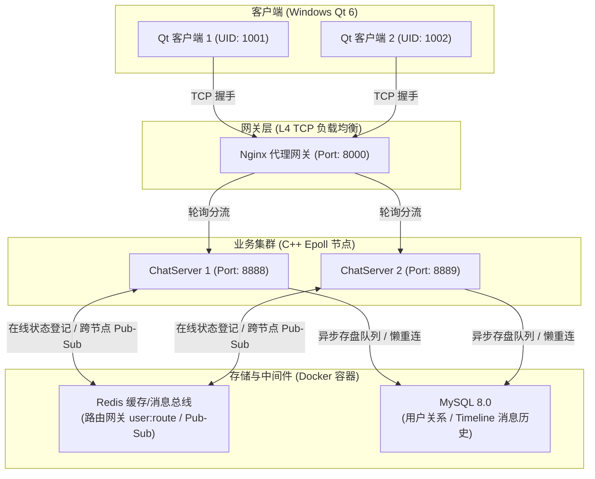

# Simple_IMChat (高性能分布式即时通讯系统)

`Simple_IMChat` 是一款基于 **C++ Epoll 网络架构**与 **Qt 6 C++ 跨平台客户端**构建的分布式即时通讯（IM）系统。项目整体采用 **Docker Compose 进行容器化微服务编排**，并针对高并发、高可用及消息可靠投递场景进行了全方位的深度优化，支持公网异地集群多节点横向扩展。

---

## 🏗️ 分布式系统架构图

项目整体拓扑与数据流向设计如下：



---

## 🌟 核心技术特性

1.  **应用层双向 ACK 与可靠消息投递**：
    *   引入客户端发送待确认队列（`pendingSendAckMap_`）与心跳重传定时器。
    *   实现服务端接收确认待发队列与滑动去重窗口，采用消息序列号机制规避 TCP 连接瞬断引发的丢包和乱序，达成应用层 **At-Least-Once (至少一次)** 投递保证。
2.  **增量 Timeline (时间线) 离线同步**：
    *   弃用传统的拉取式离线消息，采用增量 Timeline 架构。通过单调递增的 `msg_id` 作为同步 Key。
    *   采用 **Redis ZSet 缓存最新 100 条热消息** + **C++ 异步存盘线程池落盘 MySQL 历史表**的双层存储设计，实现客户端上线毫秒级按需增量拉取。
3.  **基于 Redis 的在线状态网关与分布式路由**：
    *   各 `ChatServer` 节点启动时自动向 Redis 哈希表 `user:route` 注册自身实例 IP 与端口。
    *   节点间通过 **Redis 发布/订阅 (Pub/Sub)** 机制中转跨服单聊消息，抹平节点差异，实现平滑的横向扩展能力。
4.  **高可用数据库连接池 (Lazy Reconnect 自愈)**：
    *   在 C++ 自研连接池中实现“懒重连检测”。执行任何 `update/query` 前置拦截执行 `mysql_ping()`。
    *   若遇 Docker 一键冷启动时依赖项未就绪，或者网络断连情况，连接池将自动执行 **“毫秒级按需自愈重连”**，无需人工重启服务端。
5.  **一键容器化微服务编排**：
    *   提供多阶段构建（Multi-stage Build）的 `Dockerfile`，体积更小，并配套一键拉起 MySQL、Redis、Nginx、双服务节点的 `docker-compose.yml` 脚本。

---

## 🛠️ 项目目录结构

```text
Simple_IMChat/
├── ChatServer/               # C++ 服务端源码目录
│   ├── include/              # 头文件 (网络、数据库连接池、Redis)
│   ├── src/                  # 业务实现源码 (chatservice, model, db)
│   ├── CMakeLists.txt        # 服务端编译脚本
│   └── Dockerfile            # C++ 编译与运行时多阶段构建文件
├── IMchat/                   # Qt 6 客户端源码目录
│   ├── net/                  # TCP 套接字包装与可靠投递逻辑 (imclient)
│   ├── ui/                   # 登录、注册、主界面聊天窗口界面组件
│   └── IMchat.pro            # Qt 编译工程文件
├── 数据库/
│   └── 数据库设计.md          # 详细的物理表及索引初衷权衡说明
├── 项目优化内容/               # 针对各大面试高含金量亮点的原理性技术文档
├── docker-compose.yml        # 云端一键容器部署编排脚本
└── init.sql                  # 数据库初始化建表与预灌入测试数据脚本
```

---

## 🚀 编译与部署指南

### 1. 云服务端一键部署 (Docker Compose)

在装有 Docker 及 Docker Compose 的云服务器（推荐 CentOS/Alibaba Linux 3 或 Ubuntu）上：

```bash
# 克隆代码仓库
git clone https://github.com/toh520/Simple_IMChat.git
cd Simple_IMChat

# 如果是 CentOS / Alibaba Linux 系列，请关闭与 Docker 网桥冲突的系统防火墙以开放路由
systemctl stop firewalld
systemctl disable firewalld
systemctl restart docker

# 一键编译并拉起所有微服务容器 (自动在 8000 端口监听网关代理)
docker-compose up -d --build
```

### 2. 本地 Windows 客户端编译 (Qt 6)

1.  使用 **Qt Creator** 打开项目下的 `IMchat/IMchat.pro`。
2.  定位至 `net/imclient.h`，将默认服务器连接参数更新为您的云服务器公网 IP：
    ```cpp
    static constexpr const char *kServerHost = "您的云服务器IP";
    quint16 serverPort_{8000}; // Nginx 负载均衡端口
    ```
3.  点击左下角 **“运行” (Ctrl + R)** 按钮完成 Windows 端编译与登录测试。

---

## 📝 开发者与面试说明

项目根目录的 **`项目优化内容`** 目录中存放了以下高含金量专题报告，深入分析了开发期间的架构思考，并归纳了大量可直接写入简历的成果表述及高频经典面试题 (Q&A)：
*   `01_应用层双向ACK与可靠投递.md`
*   `02_基于Redis的在线状态网关与分布式路由.md`
*   `03_好友申请与实时在线状态感知.md`
*   `04_基于Redis缓存与C++异步存盘线程的离线消息同步.md`
*   `05_基于Nginx的L4负载均衡与多节点横向扩展.md`
*   `06_基于Docker的分布式部署与网络时序自愈高可用改造.md`
