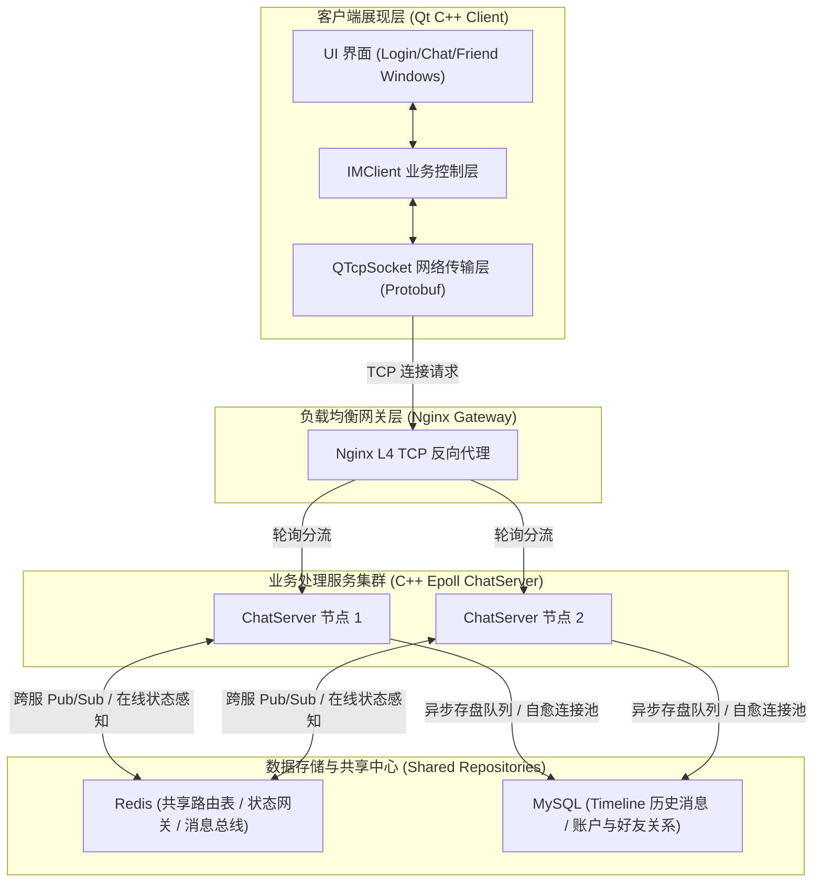
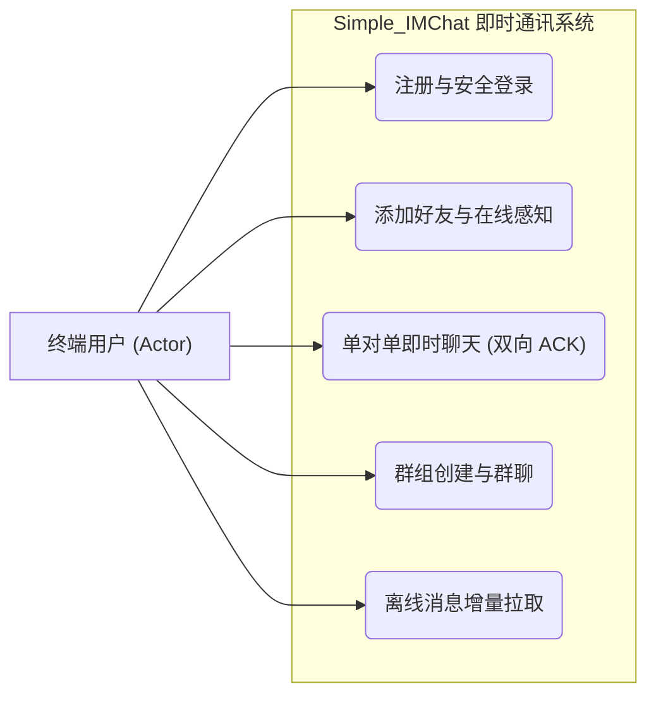
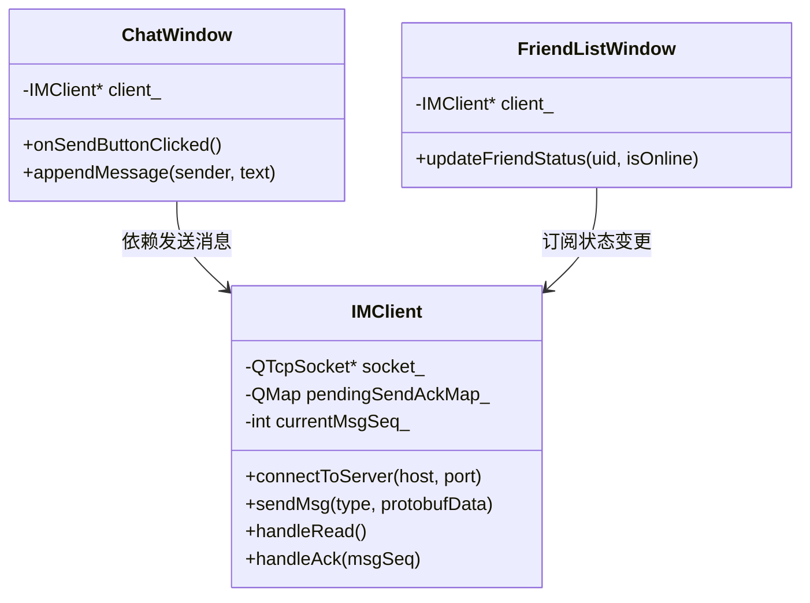
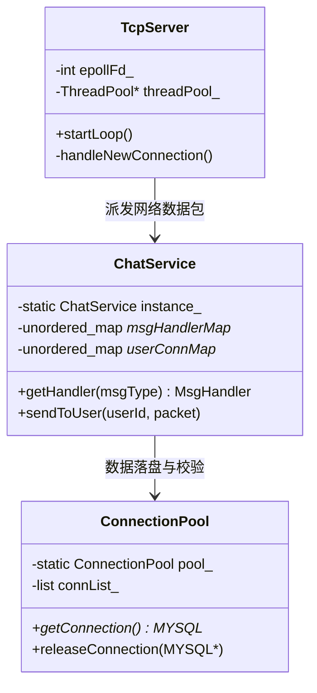
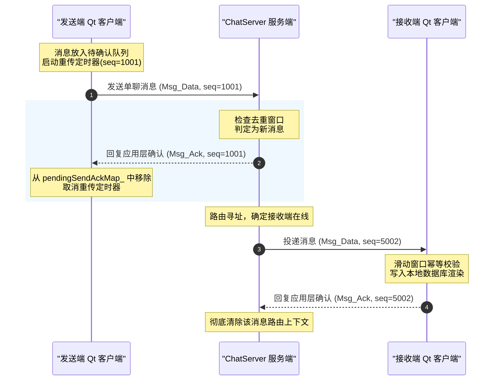
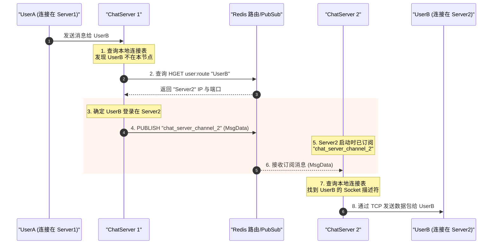
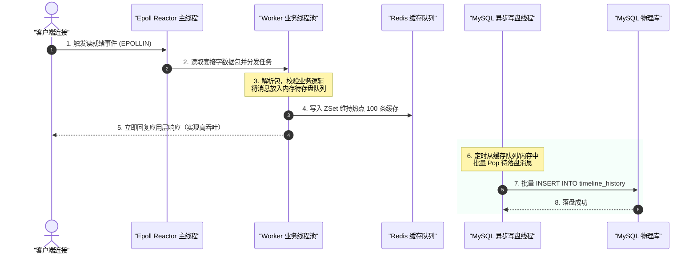
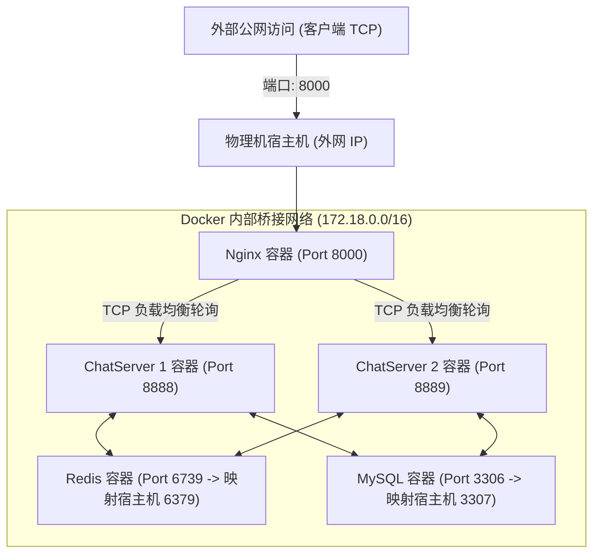
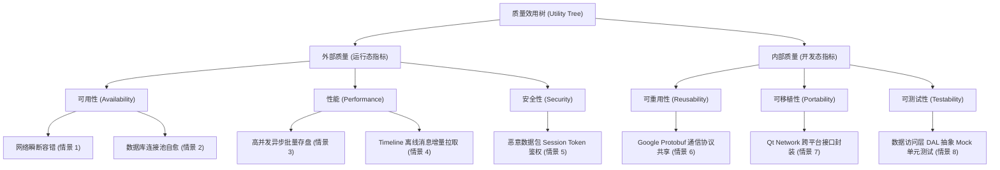
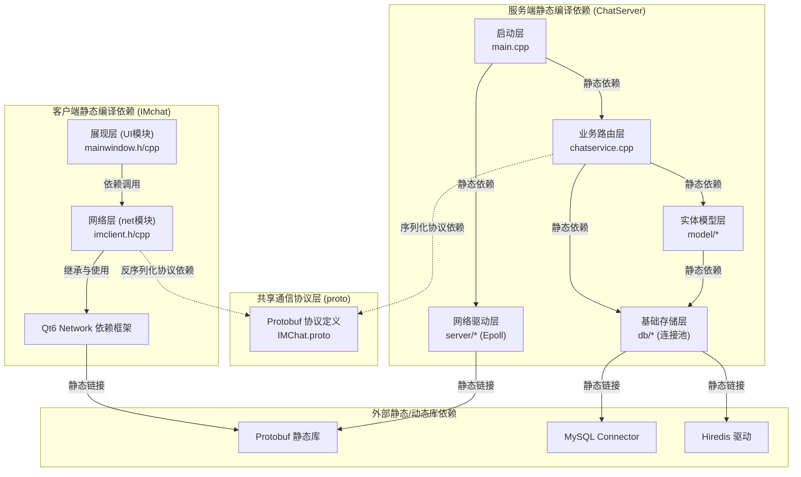

# Simple_IMChat 软件体系结构大作业 - UML与架构图大全

本文件为您汇总了本系统《软件体系结构课程设计报告》和《汇报PPT》中所需的全部 **9 张系统设计、时序与物理网络拓扑图**。所有图均基于标准的 Markdown Mermaid 语法进行编写。

---

## 💡 Mermaid 架构图生成与截图指南

### 1. 在 VS Code 中一键预览与导出（推荐）
*   **第一步：安装插件**：在 VS Code 插件市场搜索并安装 `Markdown Preview Mermaid Support` 插件（或使用带有 Mermaid 渲染支持的 `Markdown All in One` 插件）。
*   **第二步：开启预览**：右键点击本 `.md` 文件，选择 **“打开侧边预览 (Open Preview to the Side)”**（快捷键 `Ctrl + K, V`），即可在右侧实时看到精美绘制好的 UML 图与时序图。
*   **第三步：保存为图片**：
    *   *方式 A（快捷截图）*：直接对右侧预览区进行高清截图，裁剪边缘后即可贴入 Word 报告或 PPT 占位框中。
    *   *方式 B（高清导出）*：如果您安装了 `Markdown Preview Enhanced` 插件，在预览区的 Mermaid 图上右键，选择 **“Save as PNG”** 或 **“Export as SVG”**，即可无损导出超清矢量大图。

### 2. 在线一键生成并导出为 PNG/SVG
如果您不想在本地配置插件，也可以直接将本文件中的 Mermaid 代码块（即 ` ```mermaid ` 到 ` ``` ` 之间的文本）复制并粘贴到 **Mermaid Live Editor (https://mermaid.live/)** 官方在线编辑器中。在左侧粘贴代码，右侧即可生成超精美图表，并提供一键下载 PNG 或 SVG 格式的功能。

---

## 📊 UML与系统架构图源码合集

### 1. 异构混合风格总架构拓扑图
*   **应用位置**：Word 报告第三章开头、PPT 幻灯片第 3 页。
*   **展示作用**：展示 C/S 风格、分层架构、事件 Reactor 以及 Redis 共享仓库的混合流转模型。



---

### 2. 核心社交用例模型图 (场景视图)
*   **应用位置**：Word 报告第 4.1 节、PPT 幻灯片第 4 页左侧。
*   **展示作用**：呈现即时通讯大作业的核心场景用例图。



---

### 3. 客户端核心类结构 UML 类图 (逻辑视图)
*   **应用位置**：Word 报告第 4.2.1 节、PPT 幻灯片第 4 页右侧。
*   **展示作用**：描述 Qt 客户端面向对象设计类图。



---

### 4. 服务端消息分发核心类结构 UML 类图 (逻辑视图)
*   **应用位置**：Word 报告第 4.2.2 节、与图 4.2 组合展示。
*   **展示作用**：呈现服务端基于回调映射的高内聚类图设计。



---

### 5. 应用层双向 ACK 与滑动去重窗口时序图 (过程视图)
*   **应用位置**：Word 报告第 4.3.1 节、PPT 幻灯片第 5 页。
*   **展示作用**：说明网络瞬断时系统在应用层进行防丢包、防重传冗余的时序交互流程。



---

### 6. 分布式跨节点消息 Pub/Sub 路由转发时序图 (过程视图)
*   **应用位置**：Word 报告第 4.3.2 节、PPT 幻灯片第 6 页。
*   **展示作用**：说明当两个聊天用户登录在不同的物理服务器节点时，系统如何借助 Redis 消息总线实现路由中转。



---

### 7. 服务端 Epoll Reactor 与异步批量刷盘多线程协作图 (过程视图)
*   **应用位置**：Word 报告第 4.3.3 节。
*   **展示作用**：描述系统多线程并发架构，说明网络主线程、业务工作线程池与异步写盘线程的协同。



---

### 8. 基于 Docker Compose 的多容器物理部署拓扑图 (物理视图)
*   **应用位置**：Word 报告第 4.5 节、PPT 幻灯片第 7 页。
*   **展示作用**：展示分布式 IM 集群环境下一键部署的网络拓扑与映射端口。



---

### 9. 体系结构质量属性分级效用树 (Utility Tree 视图)
*   **应用位置**：Word 报告第 5.1 节、PPT 幻灯片第 8 页。
*   **展示作用**：以结构化图表形式呈现内部质量指标（开发态）与外部质量指标（运行态）的评估结构。



---

### 10. 开发视图模块编译依赖图 (开发视图)
*   **应用位置**：Word 报告第 4.4 节。
*   **展示作用**：描绘客户端 UI 层、网络层与服务端业务层、实体层、DAL数据库连接池层的静态物理依赖及编译约束关系。



